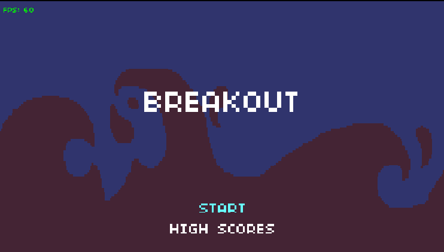
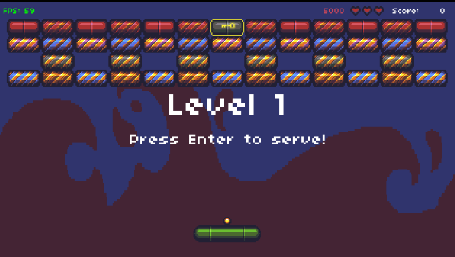
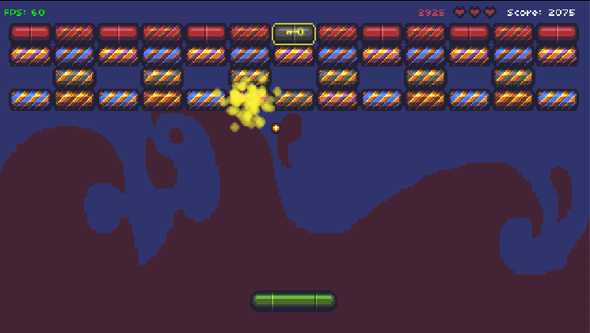

# Breakout

Project 2 of [CS50's Introduction to Games Development](https://cs50.harvard.edu/games/2018/)

[Breakout](https://en.wikipedia.org/wiki/Breakout_(video_game)) (1978) was a classic arcade game created by Atari, here it has been recreated using the  [LÖVE2D](https://love2d.org/) and programmed with Lua.

[Full project specification](https://cs50.harvard.edu/games/2018/projects/2/breakout/)

## Setup

First, clone this repository:

```bash
git clone https://github.com/calumbell/cs50g-breakout
```

Install LÖVE2D - instructions can be found [here](https://love2d.org/wiki/Getting_Started)

To run the game:

```bash
cd breakout
love .
```

## Visuals

You can see this project in action [here](https://youtu.be/lIUvVUry0JY).






## Requirements
Breakout was built using the [LÖVE2D](https://love2d.org/) engine.

[Push](https://github.com/Ulydev/push) was used for resolution-handling, and [hump](https://github.com/vrld/hump/blob/master/class.lua) was used for Lua object-orientation.
